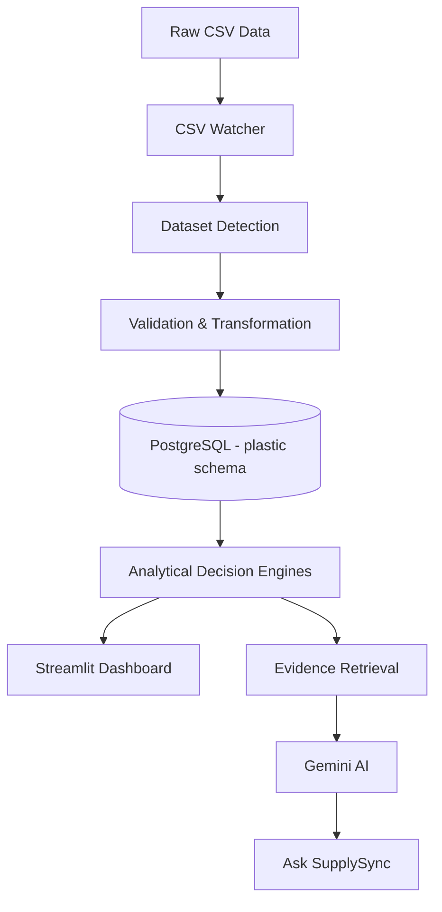
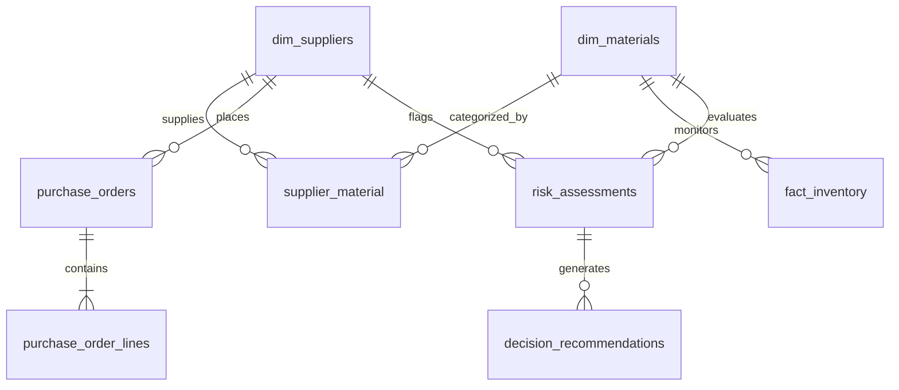
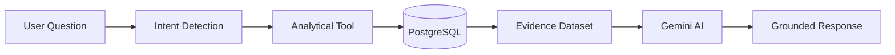

# 📦 SupplySync

### AI-Powered Supply Chain Analytics & Decision-Support Platform

<p align="center">
  <strong>
    Turn operational supply-chain data into evidence-based insights,
    risk visibility, replenishment intelligence, and AI-assisted decisions.
  </strong>
</p>

<p align="center">
  <a href="https://supplysync-7bomfjjmfjzaakmedo4c86.streamlit.app">
    🚀 <strong>Live Demo</strong>
  </a>
  &nbsp; · &nbsp;
  <a href="https://github.com/Sphurrthinaaidu-09/SupplySync">
    💻 <strong>GitHub</strong>
  </a>
</p>

<p align="center">
  
  
  
  
  
  
  
</p>

---

# 🎯 What is SupplySync?

SupplySync is an end-to-end **supply-chain intelligence and decision-support platform** that brings operational data, analytical logic, automation, and generative AI into one environment.

It works across:

- Suppliers
- Materials
- Products
- Warehouses
- Inventory
- Procurement
- Production
- Orders
- Deliveries
- Quality
- Demand
- Forecasts
- Risks
- Replenishment

The core objective is:

> **Data → Insight → Risk → Recommendation → Decision**

SupplySync helps users understand what is happening in the supply chain, identify operational exposure, investigate risks, and evaluate recommended actions using underlying analytical evidence.

---

# 💼 Business Problem

Supply-chain teams often work across multiple operational datasets and manually maintained reports.

As the number of suppliers, materials, products, warehouses, transactions, and orders increases, identifying problems and prioritizing risks becomes increasingly difficult.

Typical questions include:

- Which risks require attention right now?
- Which materials require replenishment?
- Which suppliers are creating operational exposure?
- Where are inventory shortages developing?
- What products are experiencing demand pressure?
- Where are delivery-performance issues occurring?
- What actions should supply-chain teams consider?

SupplySync addresses these challenges by bringing operational data into a **unified analytical environment**.

---

# 💡 Solution

SupplySync combines five major layers:

```text
Operational CSV Data
        ↓
Validation & Transformation
        ↓
PostgreSQL Data Layer
        ↓
Analytical Decision Engines
        ↓
Streamlit Dashboard + Grounded Gen AI
```

The platform connects:

- Data ingestion
- Data validation
- PostgreSQL database management
- Supply-chain analytics
- Risk detection
- Replenishment intelligence
- Supplier analysis
- Automation
- Natural-language AI decision support

---

# ⚙️ System Architecture



### Core Workflow

```text
CSV Update
    ↓
Watcher Detects Change
    ↓
Dataset Identification
    ↓
Validation & Transformation
    ↓
Protected PostgreSQL Load
    ↓
Ingestion Logging
    ↓
Analytics & Risk Intelligence
    ↓
Streamlit Dashboard
    ↓
Evidence-Grounded AI Support
```

---

# 🔄 Automated Data Synchronization

SupplySync includes an automated synchronization workflow for structured CSV datasets.

When a relevant CSV file is added or modified, the system can:

1. Detect the file change
2. Identify the corresponding SupplySync dataset
3. Validate required and unknown columns
4. Apply required transformations
5. Protect historical records and duplicate data
6. Load validated data into PostgreSQL
7. Record the ingestion event

### Current Local Automation Architecture

```text
Windows Task Scheduler
        ↓
CSV Watcher
        ↓
Sync / Validation Engine
        ↓
PostgreSQL
        ↓
Ingestion Monitoring
```

Power Automate was also explored as a **workflow automation and orchestration layer**.

---

# 🗄️ Data & Database Architecture

SupplySync uses **PostgreSQL** as its primary analytical data layer and organizes the application data inside the dedicated:

```text
plastic
```

schema.

### Database Areas

| Area | Main Tables |
|---|---|
| **Dimensions** | `dim_suppliers`, `dim_materials`, `dim_products`, `dim_customers`, `dim_warehouses`, `dim_inventory_policies`, `dim_date` |
| **Procurement** | `supplier_material`, `purchase_orders`, `purchase_order_lines` |
| **Inventory & Quality** | `fact_inventory`, `fact_material_receipts`, `fact_material_quality` |
| **Production** | `fact_production` |
| **Orders & Delivery** | `fact_orders`, `fact_order_lines`, `fact_deliveries` |
| **Intelligence** | `forecast_results`, `risk_assessments`, `decision_recommendations` |
| **Monitoring** | `ingestion_log` |

### Database Relationships



---

# 📊 Core Operational Modules

## 1. Executive Dashboard

Provides a high-level view of the current supply-chain operating position.

It brings together:

- Total orders
- OTIF performance
- Products at risk
- Critical risks
- Overall supply-chain status
- Priority risk queue

---

## 2. Risk Center

Provides centralized visibility into operational risks across:

- Supplier
- Inventory
- Quality
- Delivery
- Production

Risk records include information such as:

- Risk score
- Risk level
- Risk reason
- Recommended action
- Recommendation priority
- Supplier/material context
- Estimated cost
- Recommendation status

---

## 3. Replenishment Intelligence

Converts inventory exposure into procurement-oriented recommendations using:

- Current stock
- Reorder levels
- Inventory shortfall
- Lead time
- Supplier information
- Risk information
- Estimated procurement cost

---

## 4. Delivery & OTIF Analytics

Supports analysis of:

- OTIF performance
- Delivery performance
- Fulfillment
- Delivery-related exposure

---

## 5. Production & Inventory Analytics

Connects production and inventory conditions through:

- Inventory levels
- Inventory exposure
- Stockout risk
- Production activity
- Material availability
- Replenishment requirements

---

## 6. Supplier Intelligence

Supports investigation of:

- Supplier performance
- Supplier risk
- Supplier comparison
- Supplier-related operational exposure

---

## 7. Demand Analytics

Provides product-level demand analysis covering:

- Demand volume
- Demand trends
- Sales-related analysis
- Product demand exposure

---

## 8. Cost Analysis

Provides analytical visibility into:

- Procurement costs
- Spending
- Expenses
- Price-related information
- Cost exposure

---

# 🤖 Ask SupplySync — Grounded AI Decision Support

One of the core features of SupplySync is **Ask SupplySync**, a natural-language interface for supply-chain analysis.

Users can ask questions such as:

> Which supply-chain risks require my attention right now?

> Which materials need replenishment?

> Which suppliers are currently at risk?

> What products have demand exposure?

Instead of asking the language model to independently invent business answers, SupplySync first identifies the relevant analytical area and retrieves evidence from PostgreSQL.

---

# 🧠 AI Architecture



### Available Analytical Tools

- Supply Risks
- Inventory Risks
- Supplier Performance
- Product Demand
- OTIF Performance
- Cost Analysis
- Stockout Exposure
- Supplier Comparison
- Replenishment Recommendations
- Supplier Risk Summary

### AI Guardrails

The AI layer is instructed to:

- Use only the supplied analytical evidence
- Avoid inventing suppliers or products
- Avoid inventing numbers, dates, or costs
- Explain important findings first
- Identify when available evidence is insufficient
- Provide decision support rather than claim to execute procurement or operational actions

This creates a clear separation between:

```text
Data Retrieval → Analytical Logic → AI Explanation
```

---

# 📋 Decision Recommendations

The recommendation layer connects risk and analytical outputs to procurement and operational context.

Recommendations may relate to:

- Replenishment
- Supplier selection
- Production
- Delivery recovery
- Operational risk

Recommendation records can include:

- Priority
- Recommended action
- Quantity
- Supplier
- Estimated cost
- Rationale
- Recommendation status

---

# 📡 Ingestion Monitoring

SupplySync maintains an **ingestion log** to provide visibility into synchronization activity.

Tracked information includes:

- Dataset
- Upload time
- Received rows
- Validated rows
- Inserted rows
- Updated rows
- Skipped rows
- Processing status

This makes the ingestion layer observable rather than treating database loading as a black box.

---

# 📸 Application Screenshots

## 1. Executive Dashboard

The executive view brings together order performance, OTIF, risk exposure, overall supply-chain status, and the priority risk queue.


---

## 2. Risk Center

The Risk Center supports filtering and investigation by severity, risk type, product, and supplier, alongside detailed risk and recommendation context.


---

## 3. Replenishment

The Replenishment module shows items requiring replenishment, recommended units, estimated procurement cost, stock position, reorder levels, recommended order quantities, and supplier information.


---

## 4. Data Ingestion

The Data Ingestion page shows the:

**Receive → Validate → Protect → Load → Audit**

workflow, latest successful update, and recent synchronization history.


---

## 5. Ask SupplySync AI

The AI interface demonstrates natural-language supply-chain analysis grounded in PostgreSQL evidence before Gemini generates the response.


---

# 🧪 Testing & Validation

The repository contains test scripts covering different parts of the application.

### Areas Covered

- AI functionality
- Gemini connectivity
- KPI calculations
- Critical risk analysis
- Replenishment logic
- Risk Center analysis
- Analytical tools

### Representative Test Files

```text
test_ai.py
test_critical_risks.py
test_gemini.py
test_gemini_rest.py
test_kpis.py
test_replenishment.py
test_risk_center.py
test_tools.py
```

---

# 🛠️ Technology Stack

| Technology | Purpose |
|---|---|
| **Python 3.13** | Application and analytical logic |
| **Streamlit** | Interactive dashboard and user interface |
| **PostgreSQL** | Primary database and analytical data layer |
| **Gemini / Gen AI** | Natural-language decision support |
| **Power Automate** | Workflow automation and orchestration |
| **Windows Task Scheduler** | Automatic startup of the local CSV watcher |
| **Pandas** | Data processing and analysis |
| **Plotly** | Interactive data visualization |
| **psycopg2** | PostgreSQL connectivity |
| **python-dotenv** | Environment configuration |
| **Git** | Version control |
| **GitHub** | Source control and portfolio hosting |

---

# 📁 Project Structure

```text
SupplySync/
│
├── app.py
├── database.py
├── ai_engine.py
├── csv_watcher.py
├── sync_csv_to_postgres.py
├── requirements.txt
├── .gitignore
├── README.md
├── LICENSE
│
├── test_ai.py
├── test_critical_risks.py
├── test_gemini.py
├── test_gemini_rest.py
├── test_kpis.py
├── test_replenishment.py
├── test_risk_center.py
└── test_tools.py
```

---

# 🎓 Skills Demonstrated

## Data Engineering

- Data ingestion pipelines
- CSV processing
- Data validation and transformation
- PostgreSQL data modeling
- Database connectivity
- Ingestion monitoring

## Supply Chain Analytics

- Inventory analysis
- Supplier analysis
- Demand analysis
- OTIF analysis
- Cost analysis
- Stockout exposure
- Risk analysis
- Replenishment intelligence

## AI & Decision Support

- Gemini API integration
- Natural-language interfaces
- Intent detection
- Tool-based analytical retrieval
- Evidence-grounded AI responses
- AI-assisted decision support

## Application Development

- Python
- Streamlit
- Interactive dashboards
- Data visualization
- Modular application architecture

## Automation & Version Control

- CSV monitoring
- Automated database synchronization
- Windows Task Scheduler
- Power Automate workflow automation
- Git / GitHub

---

# 📌 Project Status

## 🟢 Functional Portfolio Prototype

SupplySync demonstrates an end-to-end supply-chain intelligence workflow:

```text
Data Ingestion
      ↓
Validation & Protection
      ↓
PostgreSQL
      ↓
Analytics
      ↓
Risk Detection
      ↓
Replenishment Intelligence
      ↓
Recommendations
      ↓
Streamlit Dashboard
      ↓
Grounded Gemini AI
```

The application is **deployed as a live Streamlit application** and is designed as a decision-support system.

It presents analytical evidence and recommendations to support human decision-making rather than directly executing procurement or operational actions.

### 🚀 Live Application

[**Open SupplySync Live**](https://supplysync-7bomfjjmfjzaakmedo4c86.streamlit.app)

---

# 🔮 Future Enhancements

Potential future improvements include:

- Multilingual AI interaction
- More advanced natural-language intent classification
- Automated operational alerts
- Advanced forecasting
- Supplier optimization
- Advanced inventory optimization
- Real-time data integrations
- Role-based authentication
- Automated reporting
- Greater AI explainability and traceability

---

# 👨‍💻 Author

## Sphurrthinaaidu-09

**Aspiring Data / AI & Business Analytics Professional**

### GitHub

[github.com/Sphurrthinaaidu-09](https://github.com/Sphurrthinaaidu-09)

---

<p align="center">
  <strong>
    ⭐ Built as a practical portfolio project combining supply-chain analytics,
    data engineering, automation, and grounded generative AI.
  </strong>
</p>
